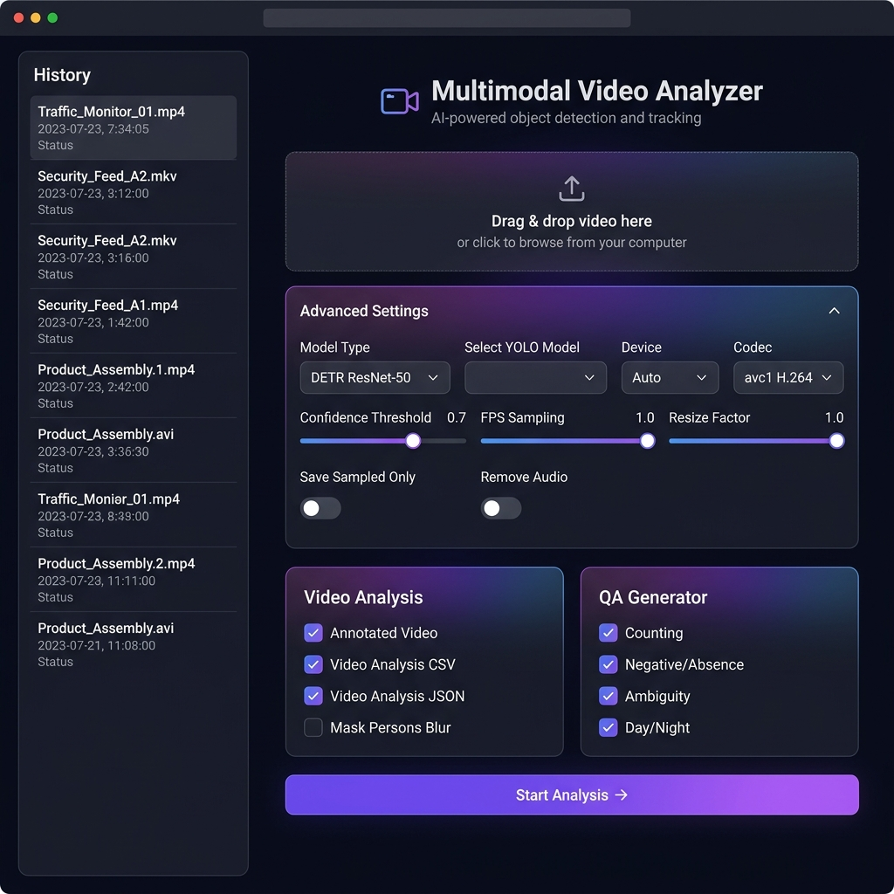
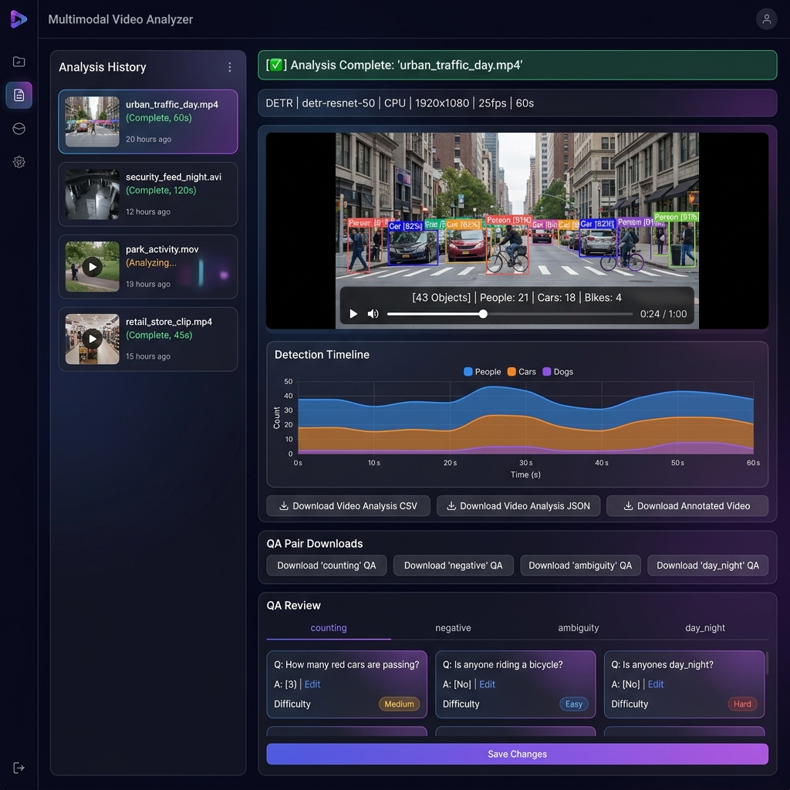

# Multimodal Video Analyzer

A modular, local video analysis platform that tracks objects using YOLOv8 or DETR, generates structured Question-Answering (QA) datasets, performs automatic privacy anonymization, and provides both a CLI interface and a rich web-based dashboard.

---

## Features

* **Modular Architecture:** Easily swap detectors by implementing the `BaseDetector` interface.
* **YOLO & DETR Object Tracking:** Built-in wrappers for Ultralytics YOLOv8 tracking and Hugging Face DETR models.
* **SimpleTracker Fallback:** A proximity- and IoU-based tracking algorithm for detectors without built-in trackers (like DETR), producing model-agnostic downstream reports.
* **Interactive Web Dashboard:** A comprehensive FastAPI-based web server featuring asynchronous background processing, real-time status polling, interactive timeline visualization, and a built-in QA editor.
* **Structured QA Dataset Generator:** Automatically segments videos into 10-second intervals and generates structured QA pairs across 4 distinct categories (Counting, Negative/Absence, Spatial-Temporal/Ambiguity, Low-Light/Day-Night).
* **HUD Overlay:** Renders bounding boxes with corner brackets, confidence tags, and a transparent HUD status bar displaying live counts, elapsed time, active model, and hardware acceleration.
* **Privacy-Preserving Person Masking:** Strong Gaussian blur applied dynamically to all detected human bounding boxes before overlay rendering.
* **Optimized Sampling:** Run inference every N frames (`--fps-sample`) and carry over/interpolate detections to speed up execution.
* **Clean Outputs:** Organizes results inside unique, timestamped folders: `output/results_{video_name}_YYYYMMDD_HHMM/`.
* **Analyzer-Style Reports:** Exports one CSV row per tracked object using the same structure as `analyzer_tool`.
* **Aggregate Reports:** Builds `total_report.csv` from per-video `report_*.csv` files.
* **Optional JSON Reports:** Full-fidelity JSON report writing containing detailed metadata, track trajectories, and frame-by-frame counts.
* **Output Size Reduction:** Flexible parameters to compress and scale down video files using Cisco OpenH264, reducing storage usage by over 90%.

---

## Project Structure

```text
multimodal-video-analyzer/
├── core/
│   ├── openh264-1.8.0-win64.dll    # Cisco H.264 library for Windows
│   ├── qa_generator.py             # QA pair generation from tracking data
│   ├── tracking.py                 # SimpleTracker & matching helpers for DETR
│   └── video_processor.py          # Core video processing pipeline & stats compiler
├── models/
│   ├── detector_interface.py       # Interface class for interchangeable detectors
│   ├── detr_detector.py            # Hugging Face DETR model wrapper
│   └── yolo_detector.py            # Ultralytics YOLOv8 model wrapper
├── utils/
│   ├── overlay_renderer.py         # HUD & bounding box rendering
│   ├── report_generator.py         # CSV, JSON & QA report writers
│   └── time_utils.py               # Timestamp formatting helpers
├── static/
│   ├── index.html                  # Web UI template
│   ├── style.css                   # Web UI styling & theme
│   └── script.js                   # Web UI frontend logic
├── docs/
│   └── images/                     # Screenshot assets for documentation
├── main.py                         # CLI entry point & model loader factory
├── web.py                          # FastAPI web server & REST API
├── requirements.txt                # Package dependencies
└── README.md                       # This documentation
```

---

## Installation

1. Ensure Python 3.12 (or higher) is installed.
2. Open your terminal in this directory and install the dependencies:
   ```bash
   pip install -r requirements.txt
   ```

---

## Web UI

The Multimodal Video Analyzer features a premium web-based dashboard that lets you run video analyses, visualize results, inspect object detection timelines, and edit or save automatically generated Q&A datasets.

### Starting the Web Server
Launch the FastAPI server by running:
```bash
python web.py
```
By default, the server starts at `http://localhost:8000`. Open this address in any modern web browser to access the dashboard.

### Web Interface Overview

#### 1. Input & Settings Panel
Configure analysis parameters via an intuitive sidebar. You can switch between **Upload Video** (to upload local video files) and **Hugging Face Dataset** (to download and process video files directly from Hugging Face dataset repositories). Choose detection models (YOLO or DETR), confidence thresholds, sampling frame rates, and enable options such as privacy masking or Q&A generation.


> [!TIP]
> **Using Hugging Face Datasets:**
> 1. Paste the URL (e.g. `https://huggingface.co/datasets/username/repo-name`) or ID (e.g. `username/repo-name`) of your Hugging Face dataset.
> 2. If accessing a **gated or private dataset**, paste your Hugging Face Access Token (Read scope) into the token input field.
> 3. Click **Fetch Videos**, select the desired video from the dropdown list, and click **Start Analysis**. The background worker will download the file and execute the analysis pipeline automatically.

#### 2. Results & QA Review Panel
Track analysis progress in real-time. Once completed, review the annotated video stream side-by-side with an interactive class-wise detection timeline. The Q&A tab allows you to inspect generated question-answer pairs per category, make edits in-place, and save updates back to disk.


---

## Usage

### 1. Basic Runs
Run the analyzer on a video file using default settings (YOLO model, 1 FPS tracking, full resolution):
```bash
python main.py analyze --input input/sample.mp4
```

### 2. Batch Processing
To process all videos inside a folder sequentially:
```bash
python main.py analyze --input input/
```

### 3. Aggregate Reports
To aggregate all per-video reports under an output directory:
```bash
python main.py total-report -i output/
```

### 4. Optional JSON Reports
JSON reports are disabled by default. Enable them explicitly:
```bash
python main.py analyze --input input/sample.mp4 --json
```

---

## CLI Parameters

### `analyze` Command
| Argument | Type | Default | Description |
| :--- | :--- | :--- | :--- |
| `--input` | `str` | *Required* | Path to the video file or folder containing videos. |
| `--output-dir` | `str` | `output` | Main output directory for results. |
| `--confidence` | `float` | `0.7` | Confidence threshold (0.0 to 1.0) below which detections are ignored. |
| `--fps-sample` | `float` | `1.0` | Target frame rate for YOLO tracking (e.g. `2.0` means sample twice per second; `0` analyzes all frames). |
| `--model-type` | `str` | `yolo` | Model architecture type (`yolo` or `detr`). Analyzer-style object tracking requires `yolo`. |
| `--model-id` | `str` | *None* | Specific model path/ID (YOLO defaults to `models/yolov8n.pt`, DETR defaults to `facebook/detr-resnet-50`). |
| `--device` | `str` | `auto` | Execution device: `cuda` (GPU), `cpu`, or `auto`. |
| `--codec` | `str` | `mp4v` | Video codec to use for output (`mp4v` or `avc1` for H.264). |
| `--resize-factor` | `float` | `1.0` | Scale factor for output video resolution (0.1 to 1.0). |
| `--save-sampled-only` | `Flag` | *Off* | If set, only writes frames analyzed by the AI model. |
| `--json` | `Flag` | *Off* | Also writes an optional JSON report. |

### `total-report` Command
| Argument | Type | Default | Description |
| :--- | :--- | :--- | :--- |
| `-i`, `--input-dir` | `str` | *Required* | Directory to scan recursively for `report_*.csv` files. |

> [!NOTE]
> Advanced parameters such as dynamic Q&A generation, person privacy masking, and interactive timeline data are fully supported via the Web UI interface.

---

## Web API Reference

The FastAPI backend exposes the following REST endpoints:

| Method | Endpoint | Description |
| :--- | :--- | :--- |
| `GET` | `/` | Serves the web UI (`static/index.html`). |
| `POST` | `/api/analyze` | Starts a background analysis task for an uploaded video file or a Hugging Face dataset video. |
| `GET` | `/api/status/{task_id}` | Polls progress, status, and metadata of a running/completed task. |
| `GET` | `/api/debug/tasks` | Returns raw in-memory status of all server tasks for debugging. |
| `GET` | `/api/download` | Serves/downloads a file from the server's output directory. |
| `GET` | `/api/results` | Retrieves the latest output file paths and report data for a video. |
| `GET` | `/api/history` | Lists all past analysis runs stored in the output directory. |
| `GET` | `/api/history/{folder_name}` | Retrieves detailed metadata and file list for a specific past run. |
| `GET` | `/api/analysis-timeline` | Returns per-second object counts for timeline visualization. |
| `GET` | `/api/qa-data` | Retrieves the JSON Q&A dataset of a given run. |
| `PUT` | `/api/qa-data` | Saves edited Q&A pairs back to their respective JSON files. |
| `GET` | `/api/stream-video` | Delivers H.264 video streams supporting HTTP range-based requests. |
| `GET` | `/api/hf/list-videos` | Lists video files available in a Hugging Face dataset repository (supports private repositories with a token). |

---

## QA Generator

The QA Generator (`core/qa_generator.py`) automatically compiles tracking data into a rich dataset of question-answer pairs.

### How It Works
- **Segmentation:** The video is divided into 10-second intervals (ignoring tiny trailing intervals less than 2.0s).
- **Temporal Analysis:** Frame-by-frame counts are aggregated over each segment.
- **Lighting & Quality Metrics:**
  - *Day/Night Identification:* Classified as "night" if the input file name matches the timestamp pattern `(\d{2})(\d{2})(\d{2})_` with hour $\ge 19$ or $< 7$, or if the average frame brightness is less than `55.0`.
  - *Blur/Motion Estimation:* If the average Laplacian variance falls below `80.0`, the segment is flagged as blurred or high-motion.
- **Visibility Tagging:** Segments are tagged as `"clear"`, `"blurred"`, or `"dark"`.

### QA Categories
Four distinct categories of QA pairs are generated based on segment metrics:

| Category | Reasoning Type | Description | Example Question |
| :--- | :--- | :--- | :--- |
| `counting` | Counting | Quantitative reasoning of objects visible within the interval. | *"How many pedestrians are visible between 0:00:10 - 0:00:20?"* |
| `negative` | Negative-absence | Confirms the absence of specific classes in the interval. | *"Is there a stroller present between 0:00:00 - 0:00:10?"* (Answer: *"No"*) |
| `ambiguity` | Spatial-temporal | Flagged as unanswerable due to severe blur or motion. | *"What is the exact class of the fast-moving object between 0:00:20 - 0:00:30?"* |
| `day_night` | Low-light robustness | Evaluates model confidence under low-light/night conditions. | *"Are vehicles detectable in the dark environment between 0:00:40 - 0:00:50?"* |

### Q&A JSON Schema
QA pairs are stored in the following format:
```json
{
  "Question": "How many pedestrians are visible between 0:00:00 - 0:00:10?",
  "Answer": "2",
  "Answer format": "open-ended",
  "Evidence spans the video": "0:00:00 - 0:00:10",
  "Reasoning type": "counting",
  "Difficulty level": "easy",
  "Visibility quality": "clear",
  "Day or night tag": "day",
  "Trajectory linkage": null,
  "Unanswerable flag": false
}
```

---

## SimpleTracker

When utilizing models that do not support built-in tracking IDs (such as DETR models), `core/tracking.py` activates `SimpleTracker`. This ensures that all downstream scripts, reports, and UI elements receive standard tracking trajectories regardless of the chosen detector.

### Multi-Phase Association Algorithm
Each raw detection frame is associated with active tracks using a 3-phase matching loop:
1. **Intersection over Union (IoU) Matching:** Detections are matched to existing tracks of the same class if the IoU is $\ge 0.15$.
2. **Proximity/Distance Fallback:** For fast-moving objects or low-FPS sampling where overlap is minimal, tracks are matched if their bounding box centroids are within `200.0` pixels.
3. **Track Initialization:** Detections remaining unmatched after both phases initialize a new track ID.

### Pruning
Tracks are kept alive during temporary occlusion or tracking failures. If an object is not detected for more than `3.0` seconds, the track is pruned from active memory.

---

## Privacy: Mask Persons

The video processing pipeline contains a built-in privacy filter (`--mask-persons` in Web UI) designed to anonymize individuals in surveillance or public area footage.

- **Dynamic Blurring:** When enabled, the pipeline intercepts each bounding box classified as `person`.
- **Gaussian Kernel Scaling:** It calculates a dynamic Gaussian blur kernel relative to the dimensions of the bounding box to ensure effective pixelation.
- **Overlay Integration:** The blurred region is drawn directly onto the video frame *before* any text labels or bounding box borders are overlaid, ensuring the identity is protected while preserving annotations.

---

## Optimizing Detection Accuracy

If the default run detects too few objects, adjust the following parameters:

1. **Lower Confidence Threshold (`--confidence`):**
   The default threshold is `0.7`. Lowering it to `0.4` or `0.5` captures smaller or partially obscured objects:
   ```bash
   python main.py analyze --input input/sample.mp4 --confidence 0.4
   ```

2. **Use a Larger YOLO Model (`--model-id`):**
   The default `yolov8n.pt` (Nano) model is optimized for speed. Choose a larger model variant (automatically downloaded by Ultralytics):
   * `yolov8s.pt` (Small) - Good speed/accuracy balance
   * `yolov8m.pt` (Medium) - Recommended default for most systems
   * `yolov8l.pt` (Large) - Highly accurate
   * `yolov8x.pt` (Extra Large) - Maximum accuracy
   
   ```bash
   python main.py analyze --input input/sample.mp4 --model-id yolov8m.pt
   ```

3. **Increase Inference Frequency (`--fps-sample`):**
   Increase the sampling rate (e.g. to `5.0` or `0` for all frames) to capture fast-moving objects.

---

## Reducing Output Video File Size

By default, output videos are written at full resolution and framerate. To compress the output video file size:

1. **Save Sampled Frames Only (`--save-sampled-only`):**
   By default, the tool duplicates the bounding boxes across all intermediate frames of the original video to match the input video's frame rate. Enabling this option tells the tool to discard these intermediate duplicate frames and only write the frames that were actually analyzed by the AI model. The playback framerate of the output video is adjusted to match the sampling frequency (`--fps-sample`), ensuring it plays at the correct real-time speed. (Reduces file size by **90-95%**).
2. **Downscale Resolution (`--resize-factor`):**
   Allows scaling down the output video dimensions. For example, `--resize-factor 0.5` reduces a 1080p (`1920x1080`) video to 540p (`960x540`). Since this decreases the total number of pixels by 75%, it results in a significantly smaller file size without affecting the AI's internal detection resolution.
3. **Use H.264 Compression (`--codec avc1`):**
   Changes the video compression format from the default legacy MPEG-4 (`mp4v`) codec to H.264 (`avc1`). H.264 offers vastly superior compression efficiency and is natively playable in modern web browsers and mobile devices. On Windows, the program dynamically loads the Cisco OpenH264 library located in the `core/` folder to enable this codec out of the box.

### Recommended Compression Command:
```bash
python main.py analyze --input input/sample.mp4 --codec avc1 --resize-factor 0.5 --save-sampled-only
```

---

## Output Files

For every video processed, a unique directory is created containing:
* **`{video_name}_analyzed.mp4`**: The annotated video with overlays. (Audio is discarded automatically to save space).
* **`report_{video_name}_analyzed.mp4.csv`**: Analyzer-style tracked-object report.
* **`report_{video_name}_analyzed.mp4.json`**: Optional JSON report, containing full metadata.
* **`{video_name}_qa_counting.json`**: QA pairs — counting category.
* **`{video_name}_qa_negative.json`**: QA pairs — negative/absence category.
* **`{video_name}_qa_ambiguity.json`**: QA pairs — blur/ambiguity category.
* **`{video_name}_qa_day_night.json`**: QA pairs — night robustness category.

Per-video CSV columns match `analyzer_tool`:
```text
object_id,first_time_seen,total_screen_time,object_type,bbox-coords
```

Aggregate CSV columns match `analyzer_tool`:
```text
filename,file-dir,video-duration,total-amount-of-persons,total-amount-of-person-screen-time,total-amount-of-cars,total-amount-of-cars-screen-time,total-amount-of-trucks,total-amount-of-trucks-screen-time,total-amount-of-other-objects,total-amount-of-other-objects-screen-time
```
